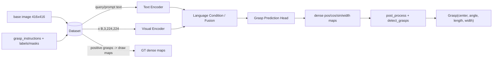

# Language-driven Grasp Detection - Phase 1 Technical Investigation Report

> 本报告只回答当前阶段的 6 个问题：数据是什么、GT 是什么、DataLoader 怎么读、模型吃什么、语言怎么进入、模型输出什么、Loss 怎么算、如何 decode、Evaluation 怎么算。
> 本报告不提出最终 Proposed Method，不开始大规模训练，也不假设当前未验证的数据结构。

## 0. Evidence Status

- 本报告证据状态为 `candidate`，不是最终运行验证结论。
- 已确认来源：
  - Hugging Face Dataset Card / API：`airvlab/Grasp-Anything`、`airvlab/Grasp-Anything-pp`
  - 官方论文：An Dinh Vuong et al., *Language-driven Grasp Detection*, CVPR 2024
  - 官方 baseline 仓库：`Fsoft-AIC/LGD`，本机副本为 `LGD-main/`
  - 原始 Grasp-Anything 代码：`Fsoft-AIC/Grasp-Anything`，本机副本为 `/tmp/grasp-lgd-research/grasp-anything-fsoft`
  - 实际读取的样本：plusplus instruction `.pkl`、positive `.pt`、part mask `.npy`、base scene description `.pkl`、base negative `.pt`
- 明确标为 `Unknown / To Verify` 的点不会在本报告中自行补全。

---

## 1. Dataset：Grasp-Anything vs Grasp-Anything++

### 1.1 关系

- `airvlab/Grasp-Anything` 是基础数据集：1M 场景样本、约 3M objects，提供 RGB 图像、scene description、object-level mask、object-level positive/negative grasp labels。
- `airvlab/Grasp-Anything-pp` 是 Grasp-Anything 的 language-driven 扩展：在基础图像之上提供 part-level grasp instructions、part-level positive/negative labels 和 part mask。
- Grasp-Anything++ 不直接包含图像；Dataset Card 明确写“You should obtain the previous Grasp-Anything dataset”。

### 1.2 Hugging Face 文件与体积

Grasp-Anything++（`airvlab/Grasp-Anything-pp`）：

| HF 文件 | 实际大小（bytes） | 内容 |
| --- | ---: | --- |
| `grasp_instructions.zip` | 1,544,210,262 | `<scene_hash>_<obj_id>_<part_id>.pkl`，实测为纯字符串 |
| `grasp_label_positive.zip` | 3,949,367,278 | `<scene_hash>_<obj_id>_<part_id>.pt`，positive grasp labels |
| `grasp_label_negative.zip` | 5,124,021,498 | `<scene_hash>_<obj_id>_<part_id>.pt`，negative grasp labels |
| `part_mask.zip` | 4,793,595,253 | `<scene_hash>_<obj_id>_<part_id>.npy`，part-level mask |

Grasp-Anything（`airvlab/Grasp-Anything`）：

| HF 文件 | 实际大小（bytes） | 内容 |
| --- | ---: | --- |
| `image_part_aa` + `image_part_ab` | 34,359,738,368 + 30,653,099,134 | 合并为 `image.zip`，内含 `<scene_hash>.jpg`，官方 README 写 416x416 |
| `scene_description.zip` | 343,076,702 | `<scene_hash>.pkl`，实测为 `(scene_description_text, [object_names])` |
| `mask.zip` | 2,211,966,302 | `<scene_hash>_<obj_id>.npy`，object-level mask |
| `grasp_label_positive.zip` | 2,174,104,198 | `<scene_hash>_<obj_id>.pt`，object-level positive grasp |
| `grasp_label_negative.zip` | 2,555,925,382 | `<scene_hash>_<obj_id>.pt`，object-level negative grasp |

### 1.3 一个 training sample 由哪些文件组成

按 Dataset Card 和文件命名，一个 HF 原始 sample 应为：

```text
<base image>/<scene_hash>.jpg                         # 416x416 RGB 场景图
<pp>/grasp_instructions/<scene_hash>_<obj_id>_<part_id>.pkl   # 该 object/part 的 grasp instruction
<pp>/grasp_label_positive/<scene_hash>_<obj_id>_<part_id>.pt  # 该 instruction 的 positive grasps
<pp>/grasp_label_negative/<scene_hash>_<obj_id>_<part_id>.pt  # negative grasps
<pp>/part_mask/<scene_hash>_<obj_id>_<part_id>.npy            # part mask
```

对齐规则：

- scene hash 对齐同一张图像。
- `obj_id` 对齐 scene 中的 object instance。
- `part_id` 对齐 object 的 part。
- plusplus 的 instruction 和 label 使用相同 stem；
- 图像只到 scene hash，不包含 obj/part 后缀，因此同一图像的不同 object/part sample 共享同一张图。

实测 plusplus sample：

- instruction：纯 `str`，例如 `Lift apple by its skin.`
- positive label：`torch.Tensor`，shape `[3, 6]`，dtype `float32`
- part mask：`numpy.ndarray`，shape `(416, 416)`，dtype `uint8`，值域实测只有 `{0,1}`

实测 base sample：

- scene description：`("A small green apple and a yellow rubber duck sitting on a wooden table", ["apple", "duck"])`
- negative grasp：`torch.Tensor`，shape `[39, 6]`，第一列质量分数为负

结论：**一个 instruction 不一定只对应一个 grasp rectangle**。positive label 文件是 `[N,6]`，测试样本 `N=3`，即一个 object/part 指令可以对应多个合法正样本 grasp。

### 1.4 Split

`LGD-main/split/grasp-anything++/` 中的 obj 文件是 pickle 列表，内容是 object-level ID，即 `<scene_hash>_<obj_id>`，不是 part-level ID。

| 文件 | 数量 | 说明 |
| --- | ---: | --- |
| `split/grasp-anything++/train/seen.obj` | 14,516 | plusplus seen training object IDs |
| `split/grasp-anything++/test/seen.obj` | 573 | seen evaluation object IDs |
| `split/grasp-anything++/test/unseen.obj` | 230 | unseen evaluation object IDs |
| `split/grasp-anything/seen.obj` | 15,089 | base seen object IDs |
| `split/grasp-anything/unseen.obj` | 8,009 | base unseen object IDs |

核对结果：

- `plusplus train/seen + plusplus test/seen == base seen`，共 15,089，无差异。
- `plusplus test/unseen == base unseen` 的 230 个 subset。
- 因此 plusplus 的 seen/unseen 是 base object-level split 在 part-level sample 上的展开。

⚠️ 代码事实：`GraspAnywhereDataset` 的 `seen=True` 读取的是 `split/grasp-anything++/test/seen.obj`，不是 `train/seen.obj`；`seen=False` 读取 `test/unseen.obj`。当前官方训练脚本如果直接运行，会先用 test seen 文件过滤训练数据，这一点必须验证或修复。

---

## 2. Ground Truth

### 2.1 `.pt` grasp label 的字段

官方 loader `utils/dataset_processing/grasp.py::_grasp_anything_format` 这样解释每行：

```python
_, x, y, w, h, theta = grasp
return Grasp(np.array([y, x]), -theta / 180.0 * np.pi, w, h).as_gr
```

因此每行是：

```text
[quality, x, y, w, h, theta_deg]
```

- `quality`：grasp quality，positive label 为正值，negative label 为负值；
- `x`：以像素为单位的 x 坐标；
- `y`：以像素为单位的 y 坐标；
- `w`：代码里作为 grasp length（沿 grasp 轴的长度）；
- `h`：代码里作为 grasp width（垂直于 grasp 轴）；
- `theta`：角度，单位是**度**，代码取负并转成弧度。

代码内部坐标顺序是 `[y, x]`，而 assignment 的外部输出要求是 `(x, y, w, h, theta)`。报告和后续代码必须明确区分这两者。

实测 positive 行示例：

```text
quality=0.0137  x=173.0  y=84.2  w=139.2  h=27.7  theta_deg=32.5
quality=0.0113  x=239.9  y=368.4 w=118.4  h=29.6  theta_deg=155.9
quality=0.0109  x=237.7  y=368.4 w=120.9  h=33.1  theta_deg=26.8
```

### 2.2 positive / negative 用途

- 论文说明正负由 grasp quality 代理指标 `T~` 决定；positive 是有效 grasp，negative 是无效 grasp。
- `load_from_grasp_anything_file` 当前只加载 `positive`，negative 部分被注释。
- `language_grasp_data.py` 只把 positive grasp 画成 dense maps。
- 当前 baseline 不消费 `grasp_label_negative`；它只可能用于 hard-negative 训练或后续自定义 loss。

### 2.3 从 5 参数到 dense GT maps

`LanguageGraspDatasetBase.__getitem__`：

```python
pos_img, ang_img, width_img = bbs.draw((self.output_size, self.output_size))
width_img = np.clip(width_img, 0.0, self.output_size / 2) / (self.output_size / 2)
```

然后：

```python
pos = pos_img                    # 1 inside compact grasp area, else 0
cos = cos(2 * ang_img)
sin = sin(2 * ang_img)
width = width_img
```

这表示官方 baseline 的监督目标不是直接回归 5 参数，而是回归 4 张 dense maps：

- `pos`：grasp quality / center likelihood map；
- `cos`、`sin`：角度按 `2*theta` 编码；
- `width`：归一化 gripper width。

---

## 3. Official Baseline Code Path

### 3.1 DataLoader

主链：

```text
HF zip/extracted data
  -> GraspAnywhereDataset / GraspAnythingDataset
  -> LanguageGraspDatasetBase.__getitem__
  -> torch.utils.data.DataLoader
```

关键代码：

| 环节 | 文件 / class / function |
| --- | --- |
| plusplus dataset | `LGD-main/utils/data/grasp_anywhere_data.py::GraspAnywhereDataset` |
| base dataset | `LGD-main/utils/data/grasp_anything_data.py::GraspAnythingDataset` |
| 通用 sample | `LGD-main/utils/data/language_grasp_data.py::LanguageGraspDatasetBase.__getitem__` |
| registry | `LGD-main/utils/data/__init__.py::get_dataset` |

`__getitem__` 返回：

```text
x, (pos, cos, sin, width), idx, rot, zoom_factor, prompt, query
```

- `x`：RGB-only 时是 `[3, H, W]`，H=W=224（configurable）；
- `y = (pos, cos, sin, width)`，每项是 `[1, H, W]` dense map；
- `prompt`：loader 中来自 `prompt/*.pkl` 的 text；
- `query`：loader 中来自 `queries[obj_id]` 的 text，当前模型实际 encode 的是 `query`。

### 3.2 官方代码期望的目录 vs HF 实际目录

**HF plusplus 实际：**

```text
grasp_instructions/*.pkl       # 纯字符串
grasp_label_positive/*.pt
grasp_label_negative/*.pt
part_mask/*.npy
```

**LGD 当前 `grasp_anywhere_data.py` 期望：**

```text
<add_file_path>/positive_grasp/*.pt
<file_path>/prompt/*.pkl
<file_path>/image/*.jpg
<add_file_path>/grasp_instructions/*.pkl   # 定义了 instruction_dir，但 get_prompts 中没有使用
```

`get_prompts` 当前从 `prompt/<scene>.pkl` 读取 `(prompt, queries)`，然后返回 `queries[obj_id]`；`instruction_dir` 和 `instruction_file` 在代码中被注释掉。

⚠️ **这是本阶段最重要的未验证点**：

1. 当前 plusplus loader 不会消费 HF 的 `grasp_instructions/*.pkl` 纯字符串。
2. HF plusplus 没有 `prompt/*.pkl` tuple 结构。
3. 官方代码的 Language 输入实际上更接近“object query”，而不一定是 HF 的完整 grasp instruction。
4. 官方训练时可能使用了另一套预整理数据目录，repo 中没有提供整理脚本。

因此 `Unknown / To Verify`：plusplus instruction 与 model text input 的最终对齐方式。

### 3.3 Preprocessing

- 原图 416x416 是确认值；
- `get_rgb` 使用 `skimage.transform.resize` 到 `output_size`；
- 默认 `output_size=224`；
- 随机增强：训练时 `random_rotate=True`（0/90/180/270 度）、`random_zoom=True`（0.5 到 1.0）；
- RGB 归一化：`/255.0` 后减整图均值，转成 `[C,H,W]`；
- GT 用 `get_gtbb` 按 `output_size / 416` scale，再与图像同步 rotate/zoom；
- 官方 plusplus 命令使用 `--use-depth 0`，所以输入是 3-channel RGB。

### 3.4 模型架构

| Network | Visual Backbone | Text Backbone | Fusion | Output |
| --- | --- | --- | --- | --- |
| `lgrconvnet3` | GR-ConvNet-like encoder-decoder | frozen CLIP ViT-B/32 | text feature 经 MLP 投影到 bottleneck spatial shape，再与 visual feature **element-wise add** | dense `pos/cos/sin/width` |
| `lggcnn` | GG-CNN-like encoder-decoder | frozen CLIP ViT-B/32 | 同上，但 fusion 在 19x19 bottleneck | dense `pos/cos/sin/width` |
| `lgdm` | ALBEF ViT + GG-CNN-like decoder | ALBEF BERT | ALBEF attention mask 乘到 RGB；text feature 投影为 spatial feature，但代码中 add 行被注释 | dense `pos/cos/sin/width`，pos 在 diffusion 中使用 |
| `clipfusion` | CLIP + RAGT detection + cross attention | CLIP | attention over grasp/text | dense maps |

### 3.5 Language 进入位置

- `lgrconvnet3`：`forward(x_in, prompt, query)` 里 encode `query`，`y_flatten` 输出 128 维，expand 成 `[B,128,56,56]`，加到 detached visual feature 上（`LGD-main/inference/models/lgrconvnet3.py:66-83`）。
- `lggcnn`：同上，expand 成 `[B,8,19,19]`（`LGD-main/inference/models/lggcnn.py:51-63`）。
- `lgdm`：`query` 经 BERT tokenizer；ALBEF 返回 `image_atts` 和 text hidden state；attention mask 上采样到 224x224 后逐像素乘到 RGB 三通道；`y` 经 MLP 变成 `[B,8,19,19]`，但注释掉的 `img.clone().detach() + y` 没有实际运行（`LGD-main/inference/models/lgdm/network.py:83-117`）。

### 3.6 模型输出与 decode

模型输出是 4 张 map：

```text
pos_output, cos_output, sin_output, width_output
```

`post_process_output`：

```python
ang_img = atan2(sin_img, cos_img) / 2.0
width_img = width_output * 150.0
```

`detect_grasps`：

- 在 `q_img` 上 `peak_local_max(min_distance=20, threshold_abs=0.2, num_peaks=1)`；
- grasp center = local max 坐标；
- grasp angle = `ang_img[center]`；
- `length = width_img[center]`，`width = length / 2`；
- 最终构造 `Grasp(center, angle, length, width)`。

因此最终的五参数由后处理得到，不是网络直接预测。

### 3.7 实测/推算 shape

- RGB input：`[B,3,224,224]`（默认参数）。
- GT maps：`[B,1,224,224]`。
- `lgrconvnet3` output：按官方卷积参数推算为 `[B,1,224,224]`。
- `lggcnn` / `lgdm` output：按官方卷积参数推算为 `[B,1,332,332]`，与 GT map 的 224x224 不直接匹配。

⚠️ `Unknown / To Verify`：当前 repo 的 GG-CNN 系 decoder 参数与默认 224 input / 224 GT 是否真的可端到端训练，需要先跑通最小 shape smoke test；不能把它当作已验证可运行代码。

---

## 4. Loss

### 4.1 非 diffusion baseline

`LanguageGraspModel.compute_loss`：

```text
L = smooth_l1(pos_pred, pos_gt)
  + smooth_l1(cos_pred, cos_gt)
  + smooth_l1(sin_pred, sin_gt)
  + smooth_l1(width_pred, width_gt)
```

`LGGCNN` 覆写为 MSE：

```text
L = mse(pos_pred, pos_gt) + mse(cos_pred, cos_gt)
  + mse(sin_pred, sin_gt) + mse(width_pred, width_gt)
```

optimizer 为 Adam（`LGD-main/train_network.py:306-311`）。

### 4.2 diffusion baseline 代码中的 loss

`diffusion/gaussian_diffusion.py::training_losses` 计算：

```text
terms["mse"] = mean((x_start - model_output)^2)
terms["contr"] = NCELoss(x_t, guiding_point, model_output)
terms["loss"] = terms["mse"] + 1e-3 * terms["contr"]
```

`NCELoss` 使用 margin=0.5，比较：

```text
model_output vs guiding_point   # positive distance
x_t vs guiding_point            # negative distance
```

但 `train_network_diffusion.py` 的实际行为是：

1. 调用 `diffusion.training_losses(...)` 计算 `losses["loss"]`；
2. **丢弃这个值**；
3. 读取 `net.pos_output_str / cos_output_str / sin_output_str / width_output_str`；
4. 调用 `net.compute_loss(...)`，backward 的是 `mse(pos) + mse(cos) + mse(sin) + mse(width)`。

`LGDM.compute_loss` 中 contrastive loss 也被注释；`ALBEF.forward` 内部算了 `loss_ita` 但没有返回用于反向传播。

结论：

- 论文声称 `L_total = L_contrastive + L_diffusion`；
- 当前 repo 训练脚本实际 backward 的是 dense map MSE；
- `diffusion` MSE + NCE 只在 `training_losses` 中出现，但未被当前训练脚本使用；
- `Unknown / To Verify`：官方用于论文的 checkpoint 是否由当前这个脚本训练得到。

---

## 5. Evaluation Protocol

代码路径：

```text
evaluate.py / evaluate_diffusion.py
  -> post_process_output
  -> evaluation.calculate_iou_match
  -> detect_grasps
  -> Grasp.max_iou -> GraspRectangle.iou
```

具体规则：

1. 每张图预测最多 1 个 grasp：
   - `q_img` 上取 local maxima；
   - `min_distance=20`；
   - `threshold_abs=0.2`；
   - `num_peaks=1`。
2. 与任意 GT grasp 比较：
   - `GraspRectangle.iou` 先检查角度差，超过 `pi/6`（30 度）直接返回 IoU=0；
   - 否则按 polygon pixels 计算 IoU；
   - `max_iou > 0.25` 判为 correct。
3. 最终 metric：

```text
success_rate = correct / (correct + failed)
```

和论文 Section 5.1 一致：IoU > 25% 且角度 offset < 30 度。

Author 主表：

| Method | Seen | Unseen | H |
| --- | ---: | ---: | ---: |
| GR-ConvNet + CLIP | 0.37 | 0.18 | 0.24 |
| GG-CNN + CLIP | 0.12 | 0.08 | 0.10 |
| CLIP-Fusion | 0.40 | 0.29 | 0.33 |
| LGD + BERT | 0.44 | 0.38 | 0.41 |
| LGD + CLIP | 0.48 | 0.42 | 0.45 |

---

## 6. Architecture / Data-flow Diagram



更语义化的管线：

```text
Language understanding
  -> target identification / visual grounding
  -> target-conditioned visual representation
  -> dense grasp maps
  -> decode to 2D grasp rectangle
```

---

## 7. Verified Data / Code Mismatches

| # | Mismatch | Status |
| --- | --- | --- |
| 1 | HF plusplus 使用 `grasp_instructions`、`grasp_label_positive`、`grasp_label_negative`、`part_mask`；LGD current code 使用 `positive_grasp`、`prompt` | Confirmed mismatch |
| 2 | `GraspAnywhereDataset` 只读取 `test/seen.obj` / `test/unseen.obj`，不读 `train/seen.obj` | Confirmed by code |
| 3 | README 写 `--network lgd`，registry 只有 `lgdm` | Confirmed mismatch |
| 4 | 当前 loader 不消费 `grasp_instructions`；实际 encode 的是 `queries[obj_id]` | Confirmed by code |
| 5 | `negative` labels 和 `part_mask` 不进入训练/评估主链 | Confirmed by code |
| 6 | GG-CNN 系模型按默认 224 input 推算输出 332x332，和 224x224 GT 不匹配 | Code-static, to verify by smoke test |
| 7 | 训练脚本实际 backward dense map MSE，不是论文所称 diffusion + contrastive total loss | Confirmed by code, mismatch with paper |
| 8 | GT width normalize 用 112，post-process 乘 150 | Code inconsistency, to verify |
| 9 | plusplus instruction 是纯字符串，LGD `get_prompts` 期望 `(prompt, queries)` tuple | Confirmed data/code mismatch |

---

## 8. Minimal Reproduction Resource Estimate（仅作为后续准备，不进入实施）

完整 plusplus 下载约 16.35 GB，完整 base 下载约 72.48 GB。

如果只做最小 baseline，至少需要：

- base image：必须（约 65 GB 合并 zip，或自行做 subset 准备）；
- plusplus `grasp_instructions.zip`：1.44 GiB；
- plusplus `grasp_label_positive.zip`：3.68 GiB；
- `grasp_label_negative.zip`、`part_mask.zip`：可选，当前 baseline 不消费。

⚠️ 因为 HF 只发布 zip，不是单文件索引，是否能用 Range/streaming 只取 subset 还没有官方工具证明；下一步必须验证后再写下载脚本。

---

## 9. 结论与下一步

当前结论：

1. DataLoader、模型、loss、eval 已经能按官方代码追踪出主链。
2. 官方代码和 HF 当前发布的数据结构不一致，不能直接解压即运行。
3. 最小 baseline 应选 `lgrconvnet3` 或修复后的 `lgdm`，以 dense maps 作为过渡表示，不能从一开始就假设直接回归五参数。
4. Proposed Method 还没有确定；正式设计前必须先用真实数据跑通一个小 subset，并确认 instruction 与 label 的 sample 对齐。

下一阶段（不进入大规模训练）：

1. 写一个只读 sample indexer，用 zip central directory 证明 `<scene>_<obj>_<part>` 对齐。
2. 做一个小 subset smoke test：dataset -> forward -> loss -> post-process -> eval。
3. 根据 smoke test 修正 loader 与模型 shape。
4. 之后再设计 Proposed Method 和实验。
